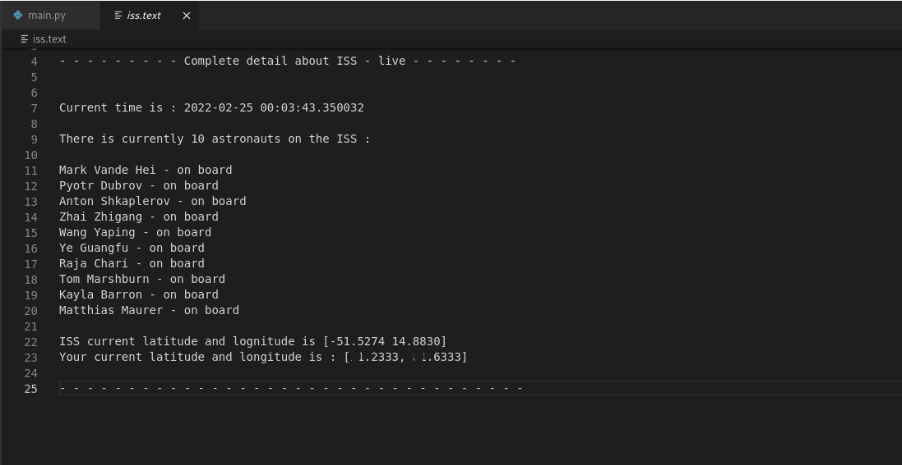

# Live-iss-locator

## About project
- Program/software, which track the location of International space station in real time
- Provide total number and name of all astronauts on-board.
- Also provide location co-ordinate of user.
- Used NASA - API in this program
- Return the output in a new/updated iss.txt file

## Language and tool used
- Language - Python
- Libraries - JSON , urllib.request, datetime, geocoder
- Tools - VS Code, Markdown (only for readme)

## Preview
